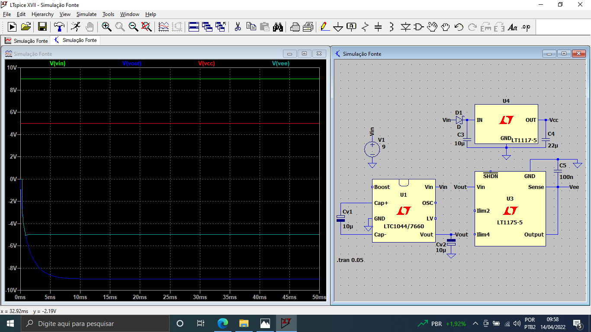

# Testador de Amplificadores Operacionais

## DESCRIÇÃO DO PROJETO

### Problemática:
Não é incomum a ocorrência de erros em aulas de laboratório que envolvem amplificadores operacionais. Em tais situações, o aluno/professor é muitas vezes incapaz de percebe se o problema é do Amp-OP utilizado, que acaba por estragar com facilidade durante as aulas práticas, ou da montagem do circuito feito pelo aluno. Na tentativa de compreender onde está o erro, gasta-se muito do tempo da aula.

### Projeto:
Este projeto visa desenvolver e montar um hardware capaz de testar a funcionalidade de um amplificador operacional, para a facilitação de aulas práticas. Ele será feito para funcionar com os modelos utilizados no IFSC – campus Florianópolis: LM324, LM741, TL082. Se um outro Amp-OP tiver o mesmo pinout de um dos citados, e sua tensão de alimentação máxima não for menor que a utilizada, o hardware também será capaz de testar a funcionalidade deste.

### Flowchart do projeto

## Desenvolvimento do Projeto

### Componentes
Componente                   | Quantidade
---------------------------  |-------------------
TL7660                       | 1
LM7805                       | 1
LM7905                       | 1
Capacitor Eletrolítico 10 uF | 2
Capacitor Eletrolítico 1 uF  | 2
Capacitor Cerâmico 330 nF    | 1
Capacitor Cerâmico 100 nF    | 1
Jack Fêmea P4                | 1
Soquete Zif 40 pinos         | 1

### Alimentação
Foi decidido que o projeto deveria poder alimentar os Amp-OPs com tensões simétricas e assimétricas de 9 e 5 volts. Isso foi feito usando uma fonte de 9V, um tl7660 para criar a tensão negativa, e dois reguladores lineares (o lm7805 e lm7905) para reduzir essas tensões para +/-5V. No final, dois botões farão o controle de qual modelo de alimentação o circuito irá fornecer ao Amp-OP.

Aqui há uma imagem da simulação. Está foi feita no LTspice, que dado sua falta de certos componentes, tivemos de simular com componentes equivalentes.

Aqui há uma imagem da montagem em protoboard. Os resultados dos testes foram o esperado.

Aqui há uma imagem do esquemático. Foi feito usando o Kikad.

A simulação e os testes foram inicialmente feitos sem carga. Após fazermos um teste de carga, percebemos que o tl7660 começa a sofrer grandes alterções na tensão de saída se a corrente fornecida passa de 20 mA. Assim, está definido que esta é a corrente negativa maxima do circuito.
