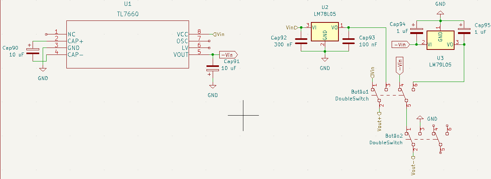
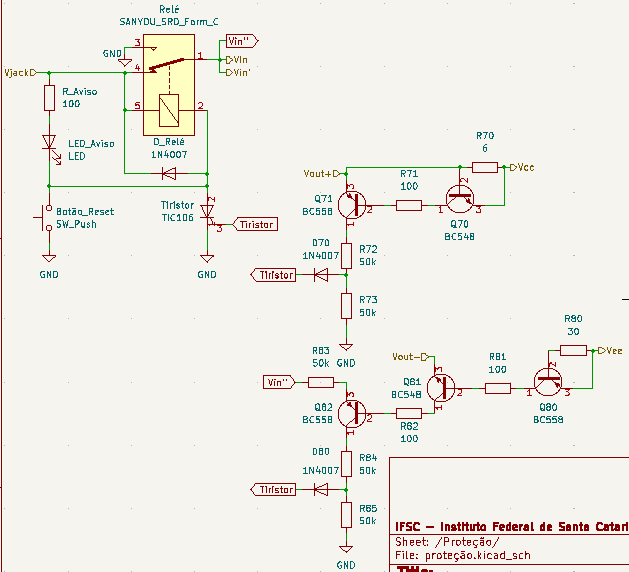
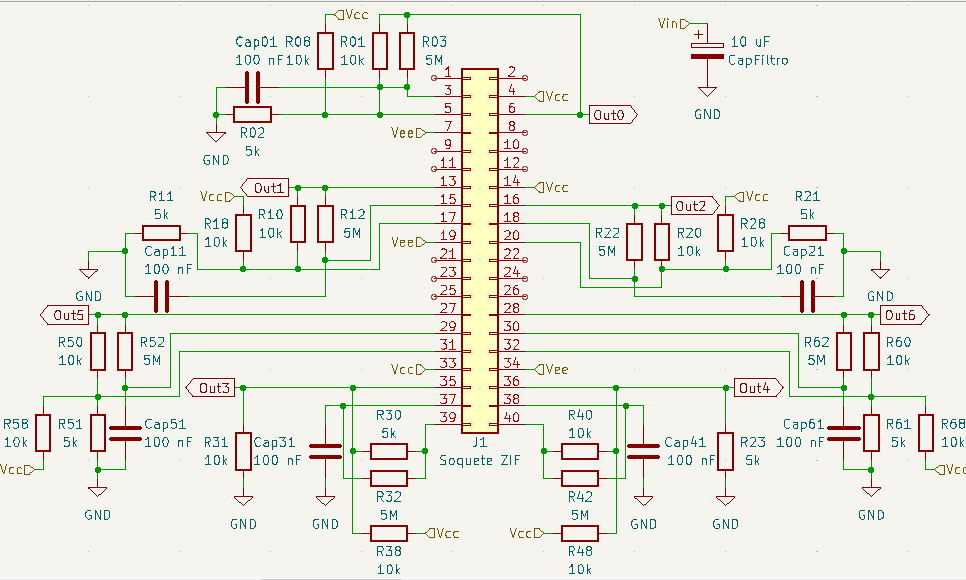
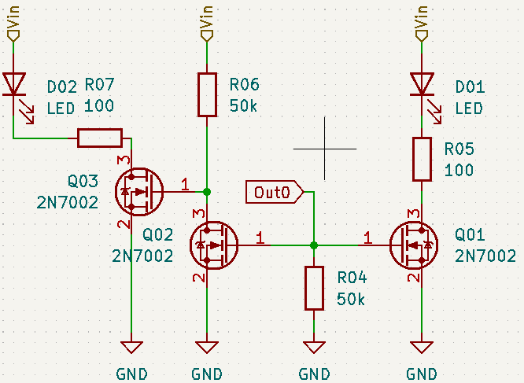

# Testador de Amplificadores Operacionais

## DESCRIÇÃO DO PROJETO

### Problemática:
Não é incomum a ocorrência de erros em aulas de laboratório que envolvem amplificadores operacionais. Em tais situações, o aluno/professor é muitas vezes incapaz de percebe se o problema é do Amp-OP utilizado, que acaba por estragar com facilidade durante as aulas práticas, ou da montagem do circuito feito pelo aluno. Na tentativa de compreender onde está o erro, gasta-se muito do tempo da aula.

### Projeto:
Este projeto visa desenvolver e montar um hardware capaz de testar a funcionalidade de um amplificador operacional, para a facilitação de aulas práticas. Ele será feito para funcionar com os modelos utilizados no IFSC – campus Florianópolis: LM324, LM741, TL082. Se um outro Amp-OP tiver o mesmo pinout de um dos citados, e sua tensão de alimentação máxima não for menor que a utilizada, o hardware também será capaz de testar a funcionalidade deste.

### Flowchart do projeto

## Desenvolvimento do Projeto

### Componentes
Componente                   | Quantidade
---------------------------  |-------------------
Jack Fêmea P4                | 1
Soquete Zif 40 pinos         | 1
Relé 12V                     | 1
LED Vermelho                 | 1
LED Verde                    | 14
.                            |
TL7660                       | 1
LM7805                       | 1
LM7905                       | 1
.                            |
Botton Switch DPDT           | 2
Button Switch SPST           | 1
Push Button                  | 1
.                             |
TIC106                       | 1
SS14                         | 1
1N4007                       | 3
BC548                        | 2
BC558                        | 3
2N7002                       | 21
.                            |
Capacitor Eletrolítico 10 uF | 3
Capacitor Eletrolítico 1 uF  | 2
Capacitor Cerâmico 330 nF    | 1
Capacitor Cerâmico 100 nF    | 8
.                            |
Resistor 5M                  | 7
Resistor 50k                 | 19
Resistor 10k                 | 14
Resistor 100                 | 18
Resistor 30 (1W)             | 1
Resistor 6 (1W)              | 1

### Alimentação
Foi decidido que o projeto deveria poder alimentar os Amp-OPs com tensões simétricas e assimétricas de 9 e 5 volts. Isso foi feito usando uma fonte de 9V, um tl7660 para a tensão negativa, e dois reguladores lineares (o lm7805 e lm7905) para redução daa tensões para +/-5V. No final, dois botões farão o controle de qual modelo de alimentação o circuito irá fornecer ao Amp-OP.

Utilizando o proteus e o Kikad, fez-se a simulação do circuito e o esquematico.

Em protoboard foi-se montado o circuito. Os resultados dos testes foram o esperado.

A simulação e os testes foram inicialmente feitos sem carga. Após fazermos um teste de carga, percebemos que o tl7660 começa a sofrer grandes alterções na tensão de saída se a corrente fornecida passa de 20 mA. Assim, está definido que esta é a corrente negativa maxima do circuito. Abaixo há uma tabela com os resutados:

Corrente de saída | Tensão de saída do tl7660
------------------|----------------------------
-5,14 mA          | -8,65 V
-6,41 mA          | -8,60 V
-8,50 mA          | -8,30 V
-17,1 mA          | -8,20 V
-25,9 mA          | -7,60 V
-52,0 mA          | -6,65 V

### Proteção
Foi decidido que o projeto deveria ser capaz de proteger o Amp-OP e a si mesmo em caso de um amplificador curto-circuitado fosse testado. Assim, decidimos que limitariamos a corrente positiva à 100 mA e a negativa à 20mA. Isso foi feito usando transistores (BC548 e BC558) em modo de chaveamento, um tiristor e um relé, junto com um LED de aviso e um botão de reset.

Assim como na alimentação, utilizamos os softwares Proteus e Kikad para, respectivamente, reazlizar a simulação e montar o esquematico.

Inumeros testes em protoboard foram feitos ao longo da projeção desta parte do circuito, até que se chegasse em um resultado satisfatorio.

### Oscilador e LEDs
Por fim há o teste do Amp-OP. Ele será feito ao colocar o Amp-OP em um soquete ZIF, e ligar o circuito. Um circuito oscilador irá gerar uma onda quadrada que irá piscar os LEDs verdes, indicando seu funcionamento. Para evitar o consumo de corrente do Amp-OP por parte do LED, o que poderia ativar a proteção, utilizamos de MOSFETs na saida, assim utilizando apenas a tensão de saída e não a corrente.

Assim como na alimentação, utilizamos os softwares Proteus e Kikad para, respectivamente, reazlizar a simulação e montar o esquematico.

Foi-se então feito teste com um dos Amp-OPs a serem utilizados, inicialmente os teste foram feitos separadamente do resto do circuito, e em seguida foram realizados testes do circuito por completo.

